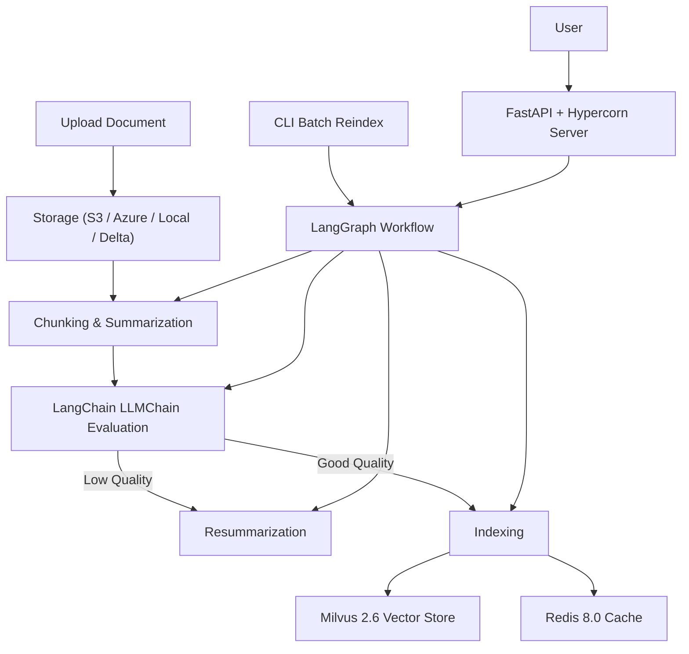

# docu-genius

An AI-powered document system built with FastAPI, LangChain, and Milvus. Supports semantic search, metadata-rich chunking, and OpenAI-based summarization to enable fast, natural-language document querying and insight generation.

This project provides an asynchronous document chunking, summarization, evaluation, and reindexing pipeline integrated with vector search (Milvus 2.6), Redis 8.0 cache, and LangChain/OpenAI (1.x) for embedding and LLM-based evaluation.

## The pipeline supports:

- Uploading documents to various storage backends (local, S3, Azure Blob, Delta Lake)
- Chunking documents with flexible strategies
- Summarizing and embedding document chunks
- Evaluating summary quality using LangChain LLMChain workflows
- Conditional resummarization on low-quality detection
- Vector indexing and caching for efficient retrieval
- Full document and chunk-level reindexing with resume support
- Batch reindexing via CLI utility
- Orchestration using LangGraph StateGraph workflows

---

## Features

- **Flexible storage**: Local filesystem, AWS S3, Azure Blob Storage, and Delta Lake support  
- **Vector search**: Milvus 2.6 client integration for fast semantic search  
- **Cache**: Redis 8.0 for chunk caching and fast keyword search  
- **LLM evaluation**: OpenAI 1.x + LangChain LLMChain for summary quality scoring  
- **Workflow orchestration**: LangGraph-based state graph for multi-step, conditional reindex pipelines  
- **Async & scalable**: FastAPI backend with async processing and Hypercorn server  
- **CLI utility**: Batch reindex documents easily from the command line  

---

## Installation

1. Clone the repository:

```bash
git clone https://github.com/lihuiniu/docu-genius.git
cd docu-genius
```

2. Create and activate a Python virtual environment (recommended):

```bash
python3 -m venv venv
source venv/bin/activate
```

3. Install dependencies:

```bash
pip install -r requirements.txt
```

4. Setup environment variables (example `.env` file):

```ini
OPENAI_API_KEY=your_openai_api_key
AWS_ACCESS_KEY_ID=your_aws_key
AWS_SECRET_ACCESS_KEY=your_aws_secret
MILVUS_HOST=localhost
MILVUS_PORT=19530
REDIS_HOST=localhost
REDIS_PORT=6379
```
5. Deploy
```bash
helm install my-docu-genius ./docu-genius-chart
```
---

## Usage

### Running the API server

Use Hypercorn to run the FastAPI app:

```bash
hypercorn api.main:app --reload --bind 0.0.0.0:8000
```

### Upload a document

```bash
curl -F "file=@./example.txt" http://localhost:8000/upload/local
```

### Check upload status

```bash
curl http://localhost:8000/upload/status/{doc_id}
```

### Summarize a document

```bash
curl -X POST http://localhost:8000/summarize   -H "Content-Type: application/json"   -d '{"doc_id": "your_doc_id", "storage": "local", "path": "./uploads/your_doc_id.txt"}'
```

### Query similar chunks

```bash
curl -X POST http://localhost:8000/query   -H "Content-Type: application/json"   -d '{"keyword": "example", "top_k": 5}'
```

### Batch reindex via CLI

```bash
python cli/reindex.py --doc-ids doc_id1 doc_id2 --storage local --concurrency 4
```

---

## Architecture Diagram



---

## Testing & CI

- Unit and async integration tests use `pytest` and `pytest-asyncio`
- GitHub Actions configured to run tests on push and PRs (`.github/workflows/ci.yml`)
- Test coverage reports and linting checks included

Run tests locally:

```bash
pytest tests/
```

---

## Notes

- Ensure Milvus 2.6 server and Redis 8.0 are running and accessible
- OpenAI API key must be valid for embeddings and LLM calls
- LangGraph workflows allow easy extension of states and conditional logic
- For large documents, consider tuning chunk size and concurrency limits
- Redis caching improves query speed for frequent lookups
- CLI utility supports parallel batch reindexing with resumable state

---

## License

MIT License © 2025 Hui Li
